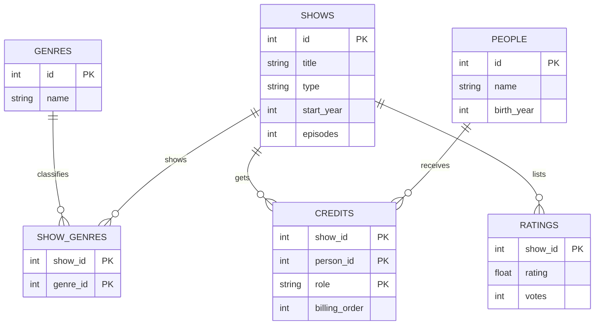

# ERD Demo

```mermaid
erDiagram
    GENRES {
        int id PK
        string name
    }

    SHOWS {
        int id PK
        string title
        string type
        int start_year
        int episodes
    }

    PEOPLE {
        int id PK
        string name
        int birth_year
    }

    SHOW_GENRES {
        int show_id PK
        int genre_id PK
    }

    CREDITS {
        int show_id PK
        int person_id PK
        string role PK
        int billing_order
    }

    RATINGS {
        int show_id PK
        float rating
        int votes
    }

    GENRES ||--o{ SHOW_GENRES : classifies
    SHOWS ||--o{ SHOW_GENRES : shows
    SHOWS ||--o{ CREDITS : gets
    PEOPLE ||--o{ CREDITS : receives
    SHOWS ||--o{ RATINGS : lists
```
